# PORTUS Fase 2
## Documento de entrega y evidencias

**Universidad de San Carlos de Guatemala**  
**Facultad de Ingeniería**  
**Escuela de Ciencias y Sistemas**  
**Curso:** Arquitectura de Computadoras y Ensambladores 2  
**Proyecto:** PORTUS - Fase 2  
**Grupo:** 5  
**Fecha de actualización:** 26/09/2026  

---

## Control del documento

| Versión | Fecha | Descripción |
|---|---|---|
| 1.0 | 26/09/2026 | Consolidación de documentación y evidencias disponibles en el repositorio. |

Este documento reúne lo que se encuentra actualmente en el repositorio. Las fotografías y capturas se presentan como evidencia visual del material disponible; no se les asigna un escenario, fecha de toma ni resultado de prueba que no estén registrados.

## 1. Resumen del proyecto

PORTUS Fase 2 amplía la maqueta de terminal portuaria de Fase 1 con una plataforma web para gestionar operaciones, documentación aduanera, citas, retenciones, alarmas y reportes. El repositorio incluye una aplicación Flask, una interfaz React, una base SQLite inicializada por el servidor, un puente serial-MQTT, un controlador simulado y el firmware Arduino de Fase 1.

El estado reportado en [status.md](../../status.md) indica que el software está funcional y que queda pendiente la integración final con la maqueta física. Esta distinción se conserva en el presente documento: una función implementada en el servidor o en el simulador no se presenta como una prueba física.

## 2. Arquitectura y alcance

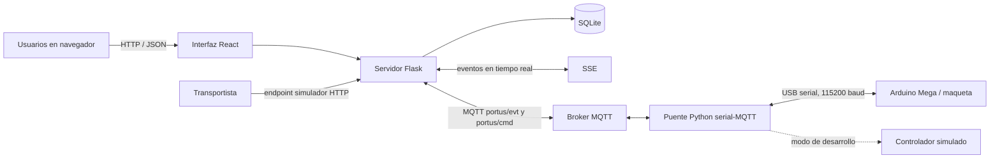

El puente y la interfaz web cuentan con rutas de desarrollo simulado. La comunicación serial estructurada en el firmware físico no está demostrada por el código actual: `Console.cpp` emite heartbeats con trama y CRC, pero conserva una consola de texto y no procesa comandos seriales estructurados ni genera ACK/NAK. El ACK/NAK sí aparece en el protocolo Python y el controlador simulado.

| Área | Disponible en el repositorio | Evidencia/estado que puede afirmarse |
|---|---|---|
| Interfaz web | Aplicación React con pantallas para TERMINAL, NAVIERA, AGENTE y AUTORIDAD | Capturas disponibles en este documento. |
| API y reglas de negocio | Flask, autenticación, roles, manifiestos, citas, turnos, retenciones, alarmas y reportes | Hay pruebas unitarias y de API; consultar sección 7. |
| Base de datos | SQLite con 14 tablas creadas por `server/database.py` | Esquema implementado; no se encontró tabla independiente de telemetría. |
| Mensajería del transportista | Servicio de comandos y endpoint simulador HTTP | No se encontró envío activo a Telegram; el token aparece como opcional en `.env.example`. |
| MQTT y SSE | Puente MQTT y flujo SSE hacia la interfaz | Implementado en software; la evidencia disponible no certifica latencia física. |
| Enlace serial | Parser/protocolo Python y heartbeat serial en firmware | Control remoto físico con tramas y ACK/NAK queda por validar/integrar. |
| Maqueta y hardware | Firmware Arduino de Fase 1 y fotografías de grúa/cableado | Las fotos evidencian componentes; no prueban por sí solas la integración Fase 2. |
| Fabricación 3D | Fotografías de modelado e impresión | No se localizaron archivos STL/3MF/STEP ni inventario de piezas. |

## 3. Responsabilidades de los componentes

| Componente | Responsabilidad documentada/implementada |
|---|---|
| Arduino Mega | Control físico determinista heredado de Fase 1, lectura de sensores y paro de emergencia; firmware en `PortusFase1_INO/PortusFase1`. |
| Puente Python | Traducción entre serial y MQTT; puede utilizar el controlador simulado. |
| Broker MQTT | Distribución de eventos y comandos con prefijo `portus/`. |
| Servidor Flask | API, sesiones, autorización, persistencia, reglas de operación y generación de reportes. |
| Interfaz React | Vistas de operación y gestión por rol; sinóptico alimentado por SSE. |
| Servicio de mensajería | Procesa comandos del transportista y permite probarlos mediante endpoint HTTP local. |
| SQLite | Persistencia de usuarios, catálogos, documentos, turnos, retenciones, citas, alarmas, patio, grúa y vinculaciones. |

El firmware de Fase 1 usa sensores y actuadores descritos en el [mapa de pines y hardware](MAPA-PINES-Y-HARDWARE.md). Las tres plazas de retención se administran lógicamente sobre el ramal descrito en ese mismo documento; no se identifican sensores físicos independientes para cada plaza.

## 4. Funciones disponibles en el software

El backend y el frontend incluyen las siguientes áreas:

- **TERMINAL:** operación/sinóptico, turnos, retenciones, patio, grúa, alarmas, citas y reportes.
- **NAVIERA:** creación y consulta de manifiestos, con separación por naviera.
- **AGENTE:** declaraciones y seguimiento documental.
- **AUTORIDAD:** decisiones de levante, canal verde/rojo, retenciones aduaneras y consulta de carga.
- **TRANSPORTISTA:** vinculación por código, citas, estado de carga y turnos mediante el servicio conversacional simulado.

El modelo SQLite crea 14 tablas: `usuarios`, `catalogo_contenedores`, `catalogo_camiones`, `manifiestos`, `declaraciones`, `citas`, `turnos`, `linea_tiempo_turno`, `retenciones`, `alarmas`, `patio_posiciones`, `grua_ciclos`, `vinculaciones_transportista` y `franjas_bloqueadas`.

Los nombres de comandos, estados, causas de retención y matriz de permisos se detallan en el [documento técnico](DOCUMENTO-TECNICO.md) y el [manual de despliegue y pruebas](MANUAL-DESPLIEGUE-Y-PRUEBAS.md). Esos documentos deben mantenerse alineados con el código fuente si cambia alguna regla.

## 5. Evidencia visual disponible

Las siguientes imágenes están almacenadas en `docs/Fase2/fotos/`. Se incluyen desde su ubicación original, sin duplicarlas.

### 5.1 Interfaz de la plataforma

**Figura 1.** Captura general de la plataforma web.

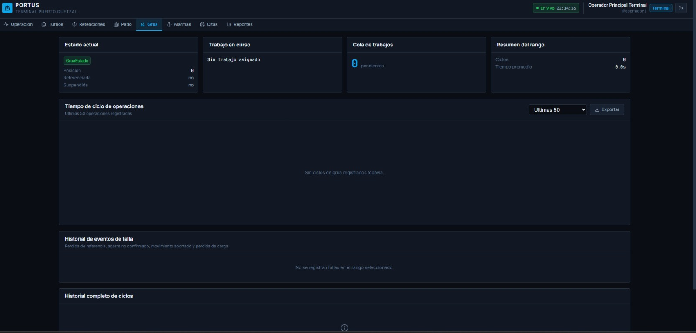

**Figura 2.** Captura adicional de la interfaz web.

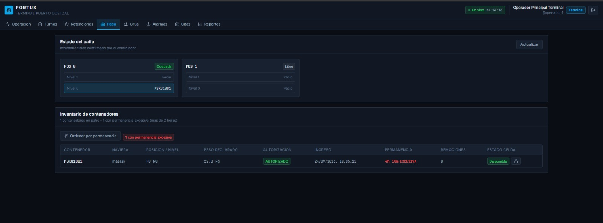

**Figura 3.** Otra vista/captura del dashboard disponible en el repositorio.

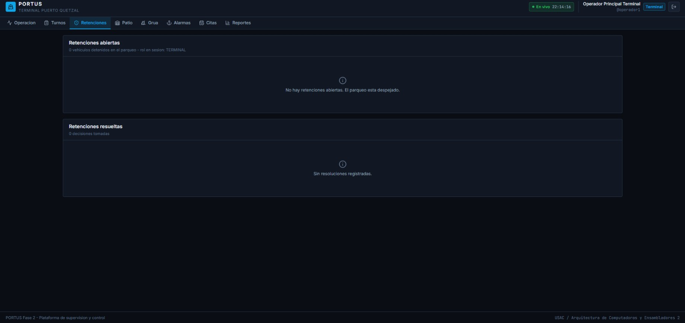

**Figura 4.** Captura guardada como evidencia de pruebas de la interfaz. No incluye un identificador de escenario ni un resultado asociado.

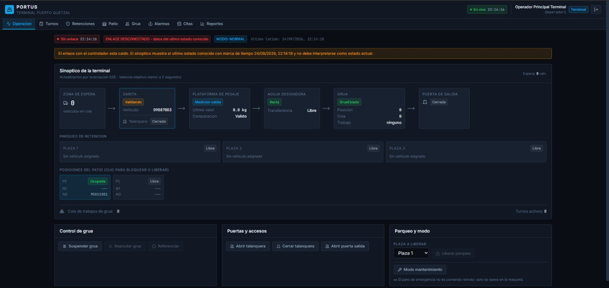

**Figura 5.** Captura adicional de pruebas de la interfaz, sin registro asociado de escenario y resultado.

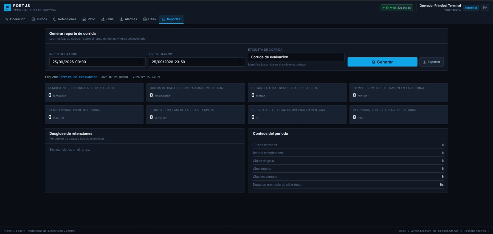

**Figura 6.** Captura adicional de pruebas de la interfaz, sin registro asociado de escenario y resultado.

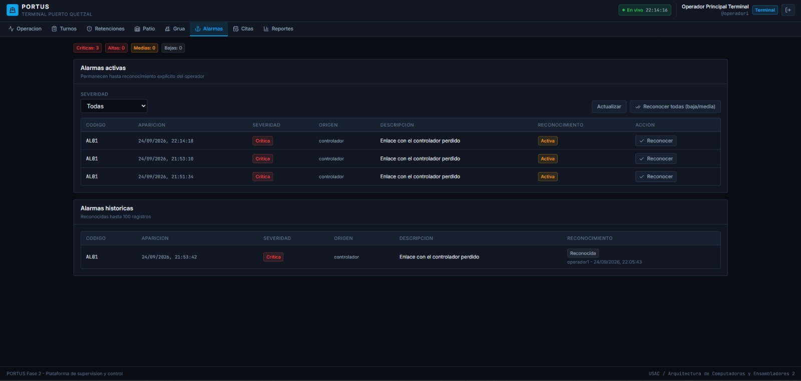

### 5.2 Maqueta y hardware

**Figura 7.** Fotografía de la grúa de la maqueta.

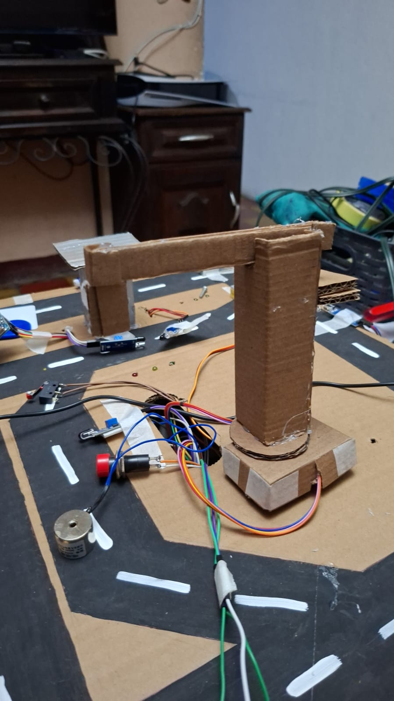

**Figura 8.** Fotografía identificada en el repositorio como separación de cables.

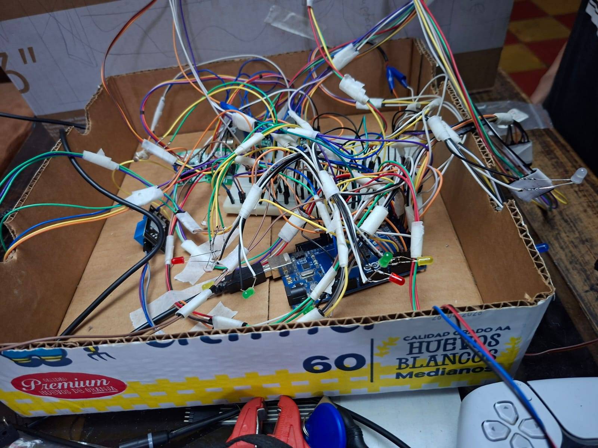

### 5.3 Modelado e impresión 3D

**Figura 9.** Imagen identificada como contenedores modelados en 3D.

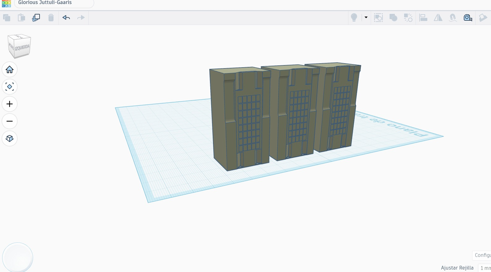

**Figura 10.** Evidencia visual de modelado 3D.

**Figura 11.** Fotografía identificada como impresión 3D.

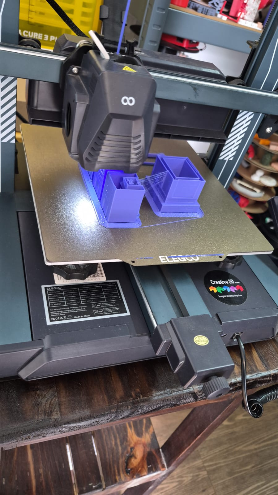

**Figura 12.** Imagen adicional de modelado 3D disponible en el repositorio.

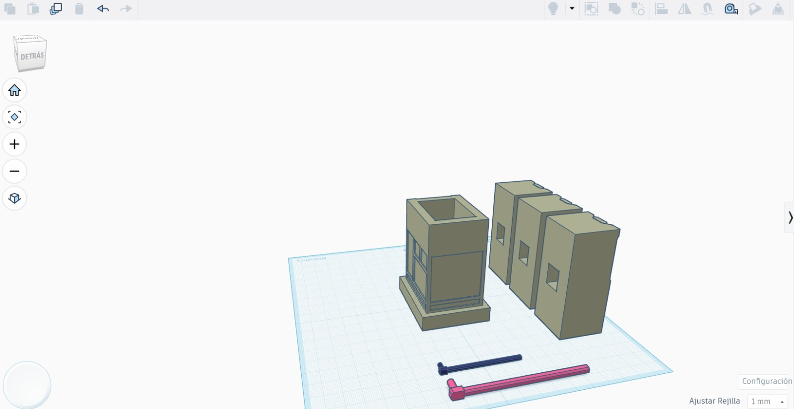

Estas fotografías permiten documentar que hay material visual sobre modelado e impresión. Para demostrar el porcentaje de piezas fabricadas y su procedencia hacen falta un inventario, la identificación de las piezas y los archivos de fabricación correspondientes.

## 6. Protocolo, comunicación y seguridad

El módulo Python `bridge/serial_protocol.py` construye y analiza tramas delimitadas con CRC16-CCITT. El firmware Arduino actual incluye un heartbeat periódico en formato estructurado. Sin embargo, en `bridge/serial_bridge.py` una trama parseada con `valid: false` no se descarta explícitamente antes del enrutamiento, por lo que la validación del CRC necesita una prueba de extremo a extremo antes de declararse garantizada.

La plataforma aplica autenticación y autorización en el backend. Las cuentas de demostración están descritas en el manual; deben utilizarse únicamente en un entorno de demostración. No deben reutilizarse contraseñas de prueba para una instalación real.

El endpoint `/api/mensajeria/simulador` permite probar los comandos conversacionales desde HTTP. Los métodos que construyen las nueve notificaciones existen, pero el repositorio revisado no contiene un adaptador activo para entregarlas a un bot de Telegram. En las pruebas o demostraciones, describirlas como mensajes generados/simulados, no como notificaciones recibidas en un teléfono.

## 7. Pruebas ejecutadas y resultados observados

Las siguientes pruebas se ejecutaron el 26/09/2026 en el entorno local indicado por el manual:

| Comando | Resultado observado | Alcance |
|---|---|---|
| `py -3.13 -m unittest discover -s PortusFase2/tests -v` | 17 pruebas: 16 pasaron y 1 falló. | Incluye pruebas de API, roles, protocolo, turnos, retenciones, mensajería y métricas. |
| `py -3.13 PortusFase2/tests/validate_scenarios.py -v` | 12 pruebas pasaron. | Valida lógica de E01-E15 mediante funciones, base SQLite y mock; varios pasos actualizan directamente la base de datos. |

La prueba fallida fue `test_02_turno_dentro_de_ventana_cumple_cita`. Se ejecutó poco después de medianoche y construyó la hora de inicio restando cinco minutos, pero guardó la fecha actual sin ajustar el cambio de día. El endpoint interpretó la cita como fuera de ventana y respondió con RT04. Este resultado debe corregirse en el fixture y volver a ejecutarse antes de reportar la suite como aprobada.

Las pruebas E01-E15 del validador no constituyen por sí solas una demostración física: no cubren toda la secuencia navegador-controlador-maqueta ni reemplazan videos/fotos con ID de prueba, resultado esperado y resultado observado. Las capturas anteriores no están enlazadas a identificadores E01-E15.

## 8. Material de documentación relacionado

| Archivo | Contenido |
|---|---|
| [Documento técnico](DOCUMENTO-TECNICO.md) | Arquitectura, protocolo, MQTT, datos, permisos, métricas y pérdida de comunicación. |
| [Manual de despliegue y pruebas](MANUAL-DESPLIEGUE-Y-PRUEBAS.md) | Instalación, arranque, credenciales de prueba y guía de los escenarios. |
| [Mapa de pines y hardware](MAPA-PINES-Y-HARDWARE.md) | Componentes y conexiones de Raspberry Pi y Arduino Mega. |
| [Fotos de Fase 2](fotos/) | Capturas web y fotografías de hardware/modelado/impresión. |
| [Estado del proyecto](../../status.md) | Resumen de alcance y estado reportado por el equipo. |
| [Especificación de Fase 2](Fase%202%20portus.pdf) | Documento de referencia del proyecto. |

